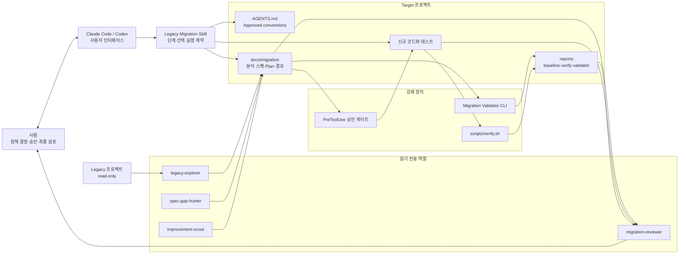

# AI Legacy Migration Kit

레거시 프로젝트의 기능을 신규 프로젝트로 옮길 때 사용하는 Claude Code·Codex 플러그인입니다.

AI에게 단순히 “이 코드를 최신 스택으로 바꿔줘”라고 맡기는 대신, **레거시 분석 → 스펙 작성 → 사람 승인 → 구현 → 자동 검증 → 독립 검토 → 사람 최종 승인**을 하나의 반복 가능한 절차로 만듭니다. 프로젝트 컨벤션과 승인 기록을 파일로 남기기 때문에, 작업자가 달라져도 같은 기준으로 이관하는 것이 목표입니다.

```text
레거시 분석 → 스펙 작성 → 사람 검토·승인 → 구현 → 테스트·레거시 대조
     ↑                                                   ↓
     └──────────── 수정 ← 독립 검토 ← 검증 실패 ─────────┘
                                      ↓
                              사람 최종 승인 → 완료
```

Claude Code · Codex · MIT License · Current version `1.7.0`

---

## 이 Kit가 해결하려는 문제

레거시 이관에서 어려운 부분은 새 문법으로 코드를 만드는 것보다 **숨은 동작을 빠뜨리지 않고, 팀이 합의한 방식으로, 검증 가능한 결과를 만드는 것**입니다.

이 Kit는 다음 문제를 다룹니다.

- 응답만 보고 구현해 soft delete, 기본값, 정렬 우선순위, 페이징 상한을 놓치는 문제
- 분석과 구현을 한 번에 시켜 확인되지 않은 동작이 코드에 들어가는 문제
- 사람마다 다른 패키지·계층·DTO·예외 처리 스타일로 생성되는 문제
- 기존 테스트 실패와 이관으로 생긴 회귀를 구분하지 못하는 문제
- AI가 “테스트했습니다”라고 말하지만 실제 실행 증거가 없는 문제
- 구현 도중 “다음 작업을 하겠습니다”라고 답변만 하고 멈추는 문제
- 승인 훅이 실패하거나 잘못된 케이스의 승인으로 잠금이 풀리는 문제
- 구현한 AI가 자기 결과를 스스로 통과시키는 문제

이 Kit가 보장하려는 것은 “AI가 항상 정답을 만든다”가 아닙니다. **AI의 분석·결정·구현·검증을 사람이 추적하고 통제할 수 있게 만드는 것**입니다.

---

## 5분 빠른 시작

### 1. 플러그인 설치

#### Codex

```bash
npx --yes github:winkrj/ai-legacy-migration-framework-kit
```

설치 확인:

```bash
codex plugin list | awk '/legacy-migration@legacy-migration-kit/'
```

#### Claude Code

```text
/plugin marketplace add winkrj/ai-legacy-migration-framework-kit
/plugin install legacy-migration@legacy-migration-kit
```

### 2. 이관 결과가 들어갈 프로젝트를 연다

레거시 프로젝트가 아니라 **신규 코드가 작성될 Target 프로젝트**에서 Codex 또는 Claude Code를 엽니다. 레거시 프로젝트는 분석할 경로로만 전달하며 read-only로 취급합니다.

### 3. 프로젝트를 한 번 세팅한다

Codex:

```text
legacy-migration 플러그인으로 이 프로젝트를 이관용으로 세팅해줘.
```

Claude Code:

```text
/legacy-migration:setup
```

setup은 `AGENTS.md`, 이관 문서 폴더, 컨벤션 템플릿, 검증 스크립트와 Codex agent role을 배치합니다. 기존 파일은 덮어쓰지 않습니다.

### 4. 기준선과 컨벤션을 준비한다

```bash
./scripts/verify.sh --baseline
```

`docs/conventions/binding-rules.md`에는 위반하면 구현을 반려할 핵심 규칙을 10줄 이내로 적고 사람이 승인합니다. 참고 프로젝트가 있다면 AI에게 실제 코드를 근거로 컨벤션 초안을 추출해달라고 요청할 수 있습니다.

### 5. 분석과 스펙부터 시작한다

Codex:

```text
notice-list 기능을 /work/legacy-admin에서 분석하고
스펙 검토 단계까지 진행해줘. 아직 구현하지 마.
```

Claude Code:

```text
/legacy-migration:start notice-list /work/legacy-admin
```

AI는 레거시를 분석하고 스펙을 작성한 뒤 멈춥니다. 사람이 결정을 채우고 구현 범위를 승인한 다음 별도 요청으로 구현합니다.

---

## 전체 실행 흐름

사용자가 보는 기본 흐름은 고위험 Full 모드에서도 동일합니다. Full은 승인 횟수를 늘리지 않고 승인 전에 만드는 분석·스펙과 검증의 깊이를 높입니다.

```text
이관 범위·허용 수정 범위 입력
            ↓
레거시 분석 + 스펙·Plan 작성
            ↓
       ✅ 사람 승인 1회
            ↓
구현 → 대상 테스트 → 실패 수정 ─┐
 ↑                              │
 └──────── 재검증 ←─────────────┘
            ↓
전체 verify → 실패 수정 → 재검증
            ↓
독립 검토 → FIX REQUIRED면 자동 수정 루프
            ↓
READY FOR HUMAN REVIEW → 사람 최종 승인
```

| 단계 | AI가 하는 일 | 사람이 하는 일 | 주요 산출물 |
|---|---|---|---|
| Setup | 프로젝트 지침·문서·검증 환경 배치 | 기존 규칙과 충돌 확인 | `AGENTS.md`, `scripts/verify.sh` |
| Scope | 이관·수정·테스트 범위를 계약 초안으로 정리 | 옮길 기능과 바꿔도 되는 Target 범위 입력 | `02_Spec.md` 또는 `03_Plan.md` |
| Discover | 레거시 진입점부터 DB·외부 연동까지 추적 | 누락된 업무 맥락 제공 | `01_Analysis.md` 또는 `01_Discover.md` |
| Specify·Plan | 요청·응답·정렬·오류·task를 승인 패키지로 작성 | 범위·스펙·task를 한 번 승인 | `02_Spec.md` 또는 `02_Specify.md`, `03_Plan.md` |
| Implement | 승인된 task만 세로 슬라이스로 구현 | 실제 blocker에만 결정 제공 | production code, tests |
| Validate | baseline과 비교해 build·test·통합 검증 | 예외로 인정할 기존 실패 확인 | `reports/verify-*.txt` |
| Review | 별도 읽기 전용 reviewer가 스펙·diff·테스트 대조, 범위 안 발견은 수정 루프로 반환 | 범위 확대·새 정책 결정만 처리 | `03_Result.md` 또는 `05_Validate.md` |
| Complete | 결과를 `READY FOR HUMAN REVIEW`로 제출 | 최종 승인 또는 수정 요청 | 사람 최종 승인 기록 |

자동 검증 PASS는 완료가 아닙니다. **독립 검토와 사람 최종 승인까지 끝나야 완료**입니다.

---

## Architecture Overview



### 아키텍처를 다섯 층으로 이해하면 쉽습니다

| 층 | 역할 | 실제 파일·컴포넌트 |
|---|---|---|
| Interaction | 사용자의 자연어 또는 명령을 받음 | Codex skill, Claude Code commands |
| Orchestration | 현재 단계와 멈춤 조건을 결정 | `skills/legacy-migration/SKILL.md`, `references/` |
| Knowledge | 프로젝트 규칙과 이관 계약을 보존 | `AGENTS.md`, `docs/conventions/`, `docs/migration/` |
| Enforcement | 승인 전 코드 변경과 우회를 차단 | `hooks/spec-gate.sh` |
| Evidence | 문서 구조, 빌드, 테스트, 최종 대조를 증명 | Validator CLI, `verify.sh`, `migration-reviewer` |

프롬프트만으로 모든 규칙을 지키게 하지 않습니다. 위험한 쓰기는 hook, 문서 구조는 Validator, 실행 결과는 verify report, 의미 대조는 독립 reviewer가 담당합니다.

---

## 프로젝트에 만들어지는 구조

```text
target-project/
├── AGENTS.md                         # 이 프로젝트에서 항상 적용할 이관 규칙
├── docs/
│   ├── conventions/
│   │   └── binding-rules.md          # 사람이 승인한 핵심 코드 컨벤션
│   └── migration/
│       └── <case>/                   # 분석·스펙·Plan·구현·검증 기록
├── reports/
│   ├── baseline-verify-*.txt         # 이관 전 상태
│   └── verify-*.txt                  # 구현 후 실행 증거
├── scripts/
│   └── verify.sh                     # build·test·선택적 integration 검증
└── .codex/
    └── agents/
        ├── legacy_explorer.toml
        ├── spec_gap_hunter.toml
        ├── improvement_scout.toml
        └── migration_reviewer.toml
```

이 파일들은 AI가 매번 기억에 의존하지 않고 동일한 계약으로 작업하게 합니다. 특히 `AGENTS.md`와 `docs/conventions/`는 Codex가 프로젝트를 다시 열어도 유지되는 프로젝트 로컬 지침입니다.

---

## Light와 Full 모드

### Light 모드

일반적인 CRUD·조회·관리 기능에 적합합니다.

| 파일 | 내용 |
|---|---|
| `01_Analysis.md` | 레거시 호출 흐름, 숨은 규칙, 코드 인용 |
| `02_Spec.md` | Target 동작 계약과 구현 승인 |
| `03_Result.md` | 구현·검증·독립 검토·사람 최종 승인 |

### Full 모드

결제, 인증, 개인정보, 공유 코드, 외부 연동, production cutover처럼 잘못 옮겼을 때 영향이 큰 기능에 사용합니다.

```text
Discover·Specify·Plan 작성 → 범위·task 승인 1회 → Implement·Validate·Fix loop → Review → Archive
```

Full 모드는 8개 이관 문서와 OpenSpec change를 만들고, API/task별 `Implementation Permission`을 사용합니다. 모든 미확인 사항을 구현 blocker로 만드는 것이 목적은 아닙니다. **이미 사용자가 결정한 내용은 승인 문서에 반영하고, 실제 정책·권한·보안 미결 사항만 `Open`으로 남깁니다. runtime/cutover 확인은 `Pending Manual Evidence` 또는 `Deferred`로 분류합니다.**

| | Light | Full |
|---|---|---|
| 대상 | 일반 기능 | 결제·인증·PII·공유 코드·cutover |
| 승인 | 스펙 패키지 1회 | 분석·스펙·Plan 패키지 1회 |
| 구현 권한 | 승인된 스펙 범위 | 승인된 task 단위 |
| 문서 | 3개 | 8개 + OpenSpec |
| 검증 | baseline·verify·독립 검토 | 동일 + Validator·AC 단위 기록 |

Full이 더 좋은 모드라서 선택하는 것이 아닙니다. 위험을 통제할 가치가 문서 비용보다 클 때 사용합니다.

---

## 실제 사용 예시

### Codex: 자연어로 사용

```text
# 프로젝트당 한 번
이 프로젝트를 legacy-migration 이관용으로 세팅해줘.

# 컨벤션 준비
/work/reference-api의 실제 코드에서 컨벤션 초안을 추출해줘.
추측하지 말고 파일과 라인 근거를 남겨줘.

# 분석과 스펙
notice-list를 /work/legacy-admin에서 분석하고 스펙 검토 단계까지 진행해줘.
아직 구현하지 마.

# 사람이 스펙을 승인한 뒤
승인된 notice-list 범위를 구현하고 테스트·verify까지 끝내줘.

# 구현 후
notice-list 이관 결과를 독립 검토하고 사람 최종 승인 준비 상태로 만들어줘.
```

구현을 한 번에 끝내고 싶다면 다음처럼 terminal condition을 명시할 수 있습니다.

```text
이 구현을 지속 목표로 등록하고, 승인된 범위의 구현·테스트·verify가 끝나거나
근거가 있는 실제 blocker가 발견될 때까지 중간 final 응답으로 종료하지 마.
```

### Claude Code: 슬래시 커맨드 사용

| 상황 | 명령 |
|---|---|
| 프로젝트 세팅 | `/legacy-migration:setup` |
| 컨벤션 등록 | `/legacy-migration:conventions [참고경로]` |
| Light 분석·스펙 | `/legacy-migration:start <기능명> <레거시경로>` |
| Full 이관 시작 | `/legacy-migration:full <기능명> <레거시경로>` |
| 승인 후 구현 | `/legacy-migration:implement <기능명>` |
| 문서 검사 | `/legacy-migration:validate <케이스명>` |
| 독립 최종 검토 | `/legacy-migration:review <기능명>` |

---

## 이미 이관 중인 프로젝트에 업데이트 적용하기

처음부터 다시 분석하거나 setup 파일을 덮어쓰지 마세요. 플러그인을 업데이트한 뒤 기존 프로젝트에서 차이를 점검하고 최소 변경만 병합합니다.

### Codex 업데이트

```bash
codex plugin marketplace upgrade legacy-migration-kit
codex plugin add legacy-migration@legacy-migration-kit
```

### Claude Code 업데이트

```text
/plugin marketplace update legacy-migration-kit
/plugin install legacy-migration@legacy-migration-kit
```

업데이트 후에는 **새 대화/thread/task를 열어야** 변경된 skill과 hook을 확실하게 읽습니다.

진행 중인 프로젝트에서는 다음처럼 요청합니다.

```text
이 프로젝트는 이전 legacy-migration 버전으로 이관을 진행하던 프로젝트다.
기존 문서와 코드를 초기화하거나 덮어쓰지 마라.

현재 git diff, 진행 중인 migration case, 승인 상태, baseline·verify 리포트,
AGENTS.md와 agent role을 먼저 점검해라.
이후 최신 버전에서 필요한 규칙만 최소 병합하고 승인된 task를 이어서 수행해라.
```

setup 스크립트는 멱등하지만 기존 `AGENTS.md`와 `scripts/verify.sh`를 덮어쓰지 않습니다. 이전 버전 파일을 최신 템플릿과 비교해 필요한 내용만 병합해야 합니다.

---

## 안전장치와 검증 방식

### 승인 게이트

`PreToolUse` hook이 이관 브랜치의 파일 변경을 검사합니다.

- Light: `02_Spec.md` 구현 승인 필요
- Full: 현재 case의 `03_Plan.md`에 task별 `Implementation Permission: Granted` 필요
- 다른 이관 case의 승인은 현재 작업을 열지 못함
- 승인 전에는 production code 쓰기와 셸 우회를 차단
- 읽기 전용 reviewer의 파일 수정은 승인 후에도 차단
- hook 실행 환경이 깨지면 코드를 허용하지 않고 fail-closed

### 레거시 근거

레거시 동작은 `파일경로:라인`과 실제 코드 인용으로만 확정합니다. 확인하지 못한 부분은 “미확인”으로 남기며 추측해서 Target 정책으로 바꾸지 않습니다.

### baseline과 verify

```bash
./scripts/verify.sh --baseline  # 이관 전
./scripts/verify.sh             # 구현 후
./scripts/verify.sh --integration
```

결과는 `reports/`에 저장됩니다. 기존 실패는 이관 전부터 존재했다는 근거와 사람의 예외 승인이 있어야만 baseline 예외로 사용할 수 있습니다.

### formatter와 lint

기본 `verify.sh`는 Maven·Gradle·npm의 build와 test를 자동 탐지하지만, 모든 프로젝트의 formatter/lint 명령을 추측해서 추가하지는 않습니다. Target 프로젝트에 이미 있는 Spotless, Checkstyle, ESLint 등의 **check 명령을 verify에 연결해야** 한 줄 코드나 컨벤션 위반을 기계적으로 막을 수 있습니다.

문서 컨벤션만으로는 완전한 강제가 아닙니다. 가능한 규칙은 formatter, lint, ArchUnit, 테스트로 옮기는 것을 권장합니다.

### Validator CLI는 왜 필요한가

[legacy-migration-validator-cli](https://github.com/winkrj/legacy-migration-validator-cli)는 코드를 생성하지 않습니다. Full 문서와 OpenSpec에서 다음 구조적 오류를 찾습니다.

- API ID와 PLAN/IMPL/VAL task 연결 누락
- Open Question이 남았는데 구현 권한을 부여한 모순
- 승인되지 않은 task를 완료로 표시한 기록
- verify 결과 파일 누락 또는 FAIL 리포트를 PASS처럼 사용한 경우
- 필수 섹션·외부 연동 경로·AC 기록 누락

Validator PASS는 **문서 구조가 일관적이라는 뜻**이지, 비즈니스 동작이 맞거나 운영 전환이 가능하다는 뜻은 아닙니다. 실제 정확성은 테스트, 레거시 대조, 독립 검토와 사람 승인이 담당합니다.

### 작성자와 검사자 분리

| 역할 | 책임 | 파일 수정 |
|---|---|---|
| `legacy-explorer` | 레거시 endpoint와 호출 흐름 탐색 | 금지 |
| `spec-gap-hunter` | 레거시와 스펙의 누락·모순 탐지 | 금지 |
| `improvement-scout` | 성능·구조 개선 후보를 이관 범위와 분리 | 금지 |
| `migration-reviewer` | 승인 스펙·diff·테스트·binding 최종 대조 | 금지 |
| main agent | 승인된 문서와 코드 작성 | 승인 범위만 허용 |

---

## 무엇을 자동으로 하지 않는가

- 레거시 저장소를 수정하지 않습니다.
- 사람이 승인하지 않은 정책을 AI가 대신 결정하지 않습니다.
- 컨벤션 초안을 자동으로 Approved 처리하지 않습니다.
- 기존 테스트 실패를 임의로 baseline 예외 처리하지 않습니다.
- 테스트를 약화해 PASS를 만들지 않습니다.
- 사용자 요청 없이 commit, push, PR/MR을 만들지 않습니다.
- 자동 검증 PASS만으로 사람 최종 승인이나 production 승인을 부여하지 않습니다.

---

## 문제에서 출발한 변경 이력

이 Kit의 버전은 기능을 임의로 늘린 기록이 아니라, 실제 이관 작업에서 실패한 지점을 재현하고 보완한 기록입니다.

### 1.7.0 — 범위 승인 뒤에는 구현·검증·수정을 끊지 않는다

**문제**

- 사용자가 원하는 흐름은 `범위 입력 → 분석·스펙 → 사람 승인 → 구현 → 테스트·수정 반복`이었지만, Full 모드는 Discover·Specify·Plan마다 승인을 요구해 실제 작업이 자주 끊겼습니다.
- 구현 단계에서 새로운 독립 기능을 다시 분석하면서 “아직 구현 중입니다”라는 보고만 반복했습니다.
- 전체 verify가 PASS해도 승인 task와 AC가 남아 있는데 중간 final 응답을 보냈습니다.
- `그래`, `해`, `완성해` 같은 짧은 후속 요청에서 이관 skill의 지속 실행 계약이 약해졌습니다.
- 독립 검토의 `FIX REQUIRED`가 사람에게 다시 돌아가 자동 수정 루프가 끊겼습니다.

**개선**

- Light/Full 모두 사람 승인 지점을 구현 전 한 번으로 통일했습니다. Full은 승인 횟수 대신 승인 패키지의 깊이를 높입니다.
- 스펙에 이관 범위, 허용 수정 범위, 교체·삭제 허용, 테스트 범위, 범위 제외를 함께 기록합니다.
- 승인은 열거된 task의 구현 → 대상 테스트 → 수정 → 전체 verify → 수정 → 독립 검토까지 지속 실행하도록 허가합니다.
- 승인된 범위 안의 기존 코드 교체·삭제·공유 코드 수정은 더 이상 blocker가 아닙니다.
- 구현 시작 시 승인 task 전체를 `READY FOR HUMAN REVIEW`로 만드는 지속 Goal을 생성하고, 짧은 후속 답변도 같은 Goal의 continue로 처리합니다.
- 같은 실패가 3회 연속 진전이 없을 때만 멈추며, 서로 다른 실패를 순차 해결하는 것은 계속합니다.
- 독립 검토가 `FIX REQUIRED`를 내도 승인 범위 안이면 자동 수정·재검증·재검토 루프로 돌아갑니다.

### 1.6.1 — “진행하겠습니다”라고 말하고 멈추는 문제

**문제**

- 승인된 파일럿 구현 중 테스트 몇 개만 수정한 뒤 “다음 작업을 진행하겠습니다”라고 final 응답을 보내 작업이 끊겼습니다.
- 사용자가 `그래`, `해`, `한 번에 다 해`라고 반복해야 했고, 그래도 선언만 하고 끝나는 흐름이 반복됐습니다.
- 기존 테스트를 삭제했지만 대체 ControllerTest와 OpenAPI 작업을 끝내지 않은 중간 상태가 남았습니다.
- 동시에 모든 편집에서 `PreToolUse hook exited with code 127`이 발생했지만 작업이 계속됐습니다.

**개선**

- 착수 후 `진행하겠습니다`·부분 패치·탐색·컴파일은 종료 조건이 아니라고 명시했습니다.
- PASS 완료 보고 또는 파일·라인 근거가 있는 실제 blocker에서만 구현 턴을 종료합니다.
- 사용자가 `한 번에`, `끝까지`, `계속 진행`을 명시하면 지원 환경에서 지속 goal로 이어갑니다.
- 이미 승인된 다음 단계에 `그래`, `해` 같은 재확인을 요구하지 않습니다.
- Codex hook을 `/bin/bash`로 실행하고 표준 PATH와 필수 명령을 검사합니다. hook을 안전하게 실행할 수 없으면 127로 무력화하지 않고 차단합니다.
- CI가 실행 지속 문구와 hook 실행 계약을 검사합니다.

### 1.6.0 — 설치 후 무엇을 준비해야 하는지와 “검증 PASS=완료” 혼동

**문제**

- 플러그인을 설치하면 바로 이관할 수 있다고 생각하기 쉬웠지만, 프로젝트 로컬 `AGENTS.md`, 컨벤션, baseline과 agent role이 없으면 작업자마다 결과가 달라졌습니다.
- 자동 테스트가 통과하면 AI가 작업을 완료로 처리했고, 구현한 주체가 자기 결과를 다시 검사했습니다.
- 다른 migration case의 승인 문서가 현재 branch의 승인으로 잘못 인식될 가능성이 있었습니다.

**개선**

- setup이 `AGENTS.md`, 문서 폴더, `verify.sh`, 컨벤션 템플릿과 네 개 agent role을 배치합니다.
- 이관 전 baseline과 구현 후 verify report를 분리했습니다.
- `migration-reviewer`가 승인 스펙·diff·테스트·binding을 독립 검토합니다.
- 자동 PASS 뒤 상태를 `READY FOR HUMAN REVIEW`로 제한하고 사람 최종 승인을 추가했습니다.
- 승인 탐색을 현재 branch/case에 한정하고 `cp`, `mv`, `touch`, `sed -i` 우회도 차단했습니다.

### 1.5.0 — 컨벤션 문서를 읽었지만 결과가 매번 달라지는 문제

**문제**

컨벤션을 프롬프트와 Markdown에 적어도 일부 규칙은 지켜지지 않았습니다. 사람과 AI 모두 문서 규칙을 놓칠 수 있었습니다.

**개선**

기계로 검사할 수 있는 계층·모듈 경계 규칙을 ArchUnit 테스트로 옮길 수 있는 스켈레톤을 추가했습니다. 단, 실제 코드가 지키지 않는 규칙을 바로 강제하지 않도록 Approved 컨벤션만 사용합니다.

### 1.4.0 — setup이 수동이고 테스트 실패 후 바로 포기하는 문제

**문제**

사용자가 디렉터리, agent role, `verify.sh`를 직접 복사해야 했습니다. 검증이 한 번 실패하면 AI가 원인을 고치지 않고 보고만 하고 끝났습니다.

**개선**

멱등 setup 명령과 검증 요약을 추가했습니다. 구현 범위 안에서 테스트 실패 원인을 최대 3회까지 수정하고 재검증합니다.

### 1.3.0 — “테스트했습니다”라는 말만 남는 문제

**문제**

통합 테스트를 실행하지 않거나 빌드가 실패했는데도 완료 보고가 나왔습니다. 완료 여부를 AI의 서술에 의존했습니다.

**개선**

`scripts/verify.sh`가 build와 test를 실행하고 timestamp report를 남깁니다. PASS report가 없으면 완료 보고를 할 수 없습니다. 실제 Maven 멀티모듈 프로젝트에서는 이 과정으로 기존 873개 테스트 중 5개 실패도 발견했습니다.

### 1.2.x — Codex 승인 hook과 읽기 전용 agent 문제

**문제**

Codex hook 경로 인용 방식 때문에 승인 게이트가 실행되지 않았고, agent role의 read-only 설정만으로는 쓰기를 확실히 막을 수 없었습니다.

**개선**

Codex hook 실행 형식을 수정하고, `agent_type`을 확인해 탐색·검토 역할의 쓰기를 hook에서 차단했습니다.

### 1.0.x~1.1.x — 규칙은 많지만 분석이 얕고 승인이 잘못 적용되는 문제

**문제**

- 규칙 133개와 긴 프롬프트 때문에 준수가 오히려 불안정했습니다.
- 응답값만 보고 구현하거나 화면이 호출하는 API를 빠뜨렸습니다.
- 케이스 폴더명과 branch명이 다르면 승인 후에도 코드 변경이 차단됐습니다.
- 차단된 AI가 heredoc으로 우회하면서 줄바꿈이 깨진 코드를 만들었습니다.

**개선**

- 핵심 불변 규칙을 줄이고 hook·Validator·템플릿으로 책임을 분리했습니다.
- API별 16문항 체크리스트와 읽기 전용 탐색 agent를 추가했습니다.
- 현재 케이스 승인 탐색과 셸 쓰기 우회 차단을 회귀 테스트로 고정했습니다.

<details>
<summary><b>0.4.0~0.9.x의 기반 변경 보기</b></summary>

- `0.9.x`: API 하나를 domain부터 테스트까지 완성하는 세로 슬라이스 도입
- `0.8.0`: 공통 코드 품질 원칙과 프로젝트별 컨벤션 분리
- `0.7.0`: Full 문서 구조와 Validator 요구사항 동기화
- `0.6.0`: API 표 한 줄 대신 Request·Response·AC 상세 계약 도입
- `0.5.0`: 파일·라인 인용, binding 규칙 재주입, 외부 연동 경로 매트릭스 도입
- `0.4.0`: Full 문서 한글화와 PLAN/IMPL/VAL task 추적 도입

</details>

---

## Repository 구조

```text
.agents/plugins/     Codex marketplace 정의
.claude-plugin/      Claude Code plugin manifest
commands/            Claude Code 슬래시 커맨드
skills/              Claude Code skill
agents/              Claude Code 읽기 전용 reviewer 역할
codex/agents/        Codex agent role
hooks/               승인·읽기 전용 강제 hook
templates/           Light·Full·OpenSpec·컨벤션·Target 템플릿
guides/              상세 운영 가이드
plugins/             배포용 Codex plugin 사본
scripts/             설치·setup·Codex 사본 동기화
examples/            Validator와 이관 문서 예제
```

루트의 공통 자산이 정본이고 `scripts/sync-codex-plugin.mjs`가 Codex 배포 사본의 drift를 검사합니다.

---

## 더 알아보기

- [따라하기 가이드](guides/Kit-Usage-Guide.html)
- [컨벤션 도입 가이드](guides/convention-adoption-guide.md)
- [Full 모드 상세 절차](guides/walkthrough-full-mode.md)
- [Codex 설치 가이드](codex/INSTALL.md)
- [Codex agent role](codex/agents/README.md)
- [문서 검사 CLI](https://github.com/winkrj/legacy-migration-validator-cli)
- [플러그인 없이 사용하는 프롬프트](prompts/start-migration.md)

---

## FAQ

<details>
<summary><b>플러그인을 설치하면 바로 이관을 시작해도 되나요?</b></summary>

먼저 Target 프로젝트에서 setup, baseline, Approved 컨벤션을 준비해야 합니다. setup 산출물이 없으면 AI에게 “이 프로젝트를 이관용으로 세팅해줘”라고 요청하세요.
</details>

<details>
<summary><b>진행 중인 프로젝트도 다시 setup해야 하나요?</b></summary>

처음부터 다시 할 필요는 없습니다. setup은 누락 파일만 추가하고 기존 파일을 덮어쓰지 않습니다. 최신 템플릿과 기존 `AGENTS.md`, `verify.sh`를 비교해 필요한 규칙만 병합하세요.
</details>

<details>
<summary><b>사용자가 이미 결정했는데 AI가 다시 Open Question으로 만들어요.</b></summary>

이미 명확히 결정한 내용은 새로운 질문이 아니라 승인 문서의 Resolved decision으로 기록해야 합니다. 다만 자연어 결정이 어떤 API/task를 승인하는지는 문서에 명확히 연결해야 hook과 reviewer가 같은 범위를 확인할 수 있습니다.
</details>

<details>
<summary><b>테스트가 실패한 채 멈췄어요.</b></summary>

새로운 실패라면 정상적인 blocker입니다. 기존 실패를 예외로 삼으려면 이관 전부터 존재했다는 report 또는 git 근거와 사람 승인이 필요합니다. assertion을 약화하거나 실패를 숨겨서는 안 됩니다.
</details>

<details>
<summary><b>왜 코드가 한 줄로 생성됐나요?</b></summary>

이전에는 승인 hook이 실패한 뒤 AI가 셸 리다이렉트로 우회하거나, formatter 없이 build·test만 통과시키는 경우가 있었습니다. 현재는 셸 코드 생성을 금지하고 hook을 fail-closed로 바꿨지만, 코드 포맷을 완전히 강제하려면 Target 프로젝트의 formatter/lint check를 `verify.sh`에 연결해야 합니다.
</details>

<details>
<summary><b>AI가 계속 “진행하겠습니다”라고만 하고 멈춰요.</b></summary>

`1.7.0` 이상으로 업데이트하고 새 task를 여세요. 승인 문서의 체크 또는 `Implementation Permission: Granted`가 지속 Goal 실행 권한을 함께 부여하므로 매번 “계속”을 반복할 필요가 없습니다. hook failure가 보이면 편집을 계속하지 말고 설치 버전과 hook 경로부터 확인해야 합니다.
</details>

<details>
<summary><b>AI가 자동으로 commit이나 push도 하나요?</b></summary>

하지 않습니다. commit, push, PR/MR은 사용자가 명시적으로 요청할 때만 수행합니다.
</details>

---

## License

MIT — [LICENSE](LICENSE)
